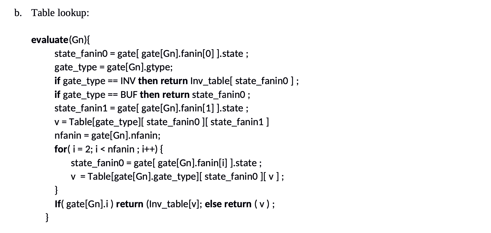

# Verilyzer

## Problem Statement

Write a simulation program that reads the intermediate file generated in part 1 and stores the gates into an array of record. In each record, dynamically allocate integer arrays to store the fanin and fanout for each gate. Create an extra gate structure and store the index in variable 'dummy_gate'.

A. Add to every fate structure an int 'sched' and set that pointer initially to -1. This pointer should be used to schedule the corresponding gate.

B. Create an array 'levels' of pointers to a gate structure of size 'max level'. 'max_level' is an integer holding the value of max level in your design. Initially, levels[i] is set to dummy_gate for all i's.

C. Use 3-valued logic {0, 1, X} to create two inputs lookup tables for the following gates AND, OR, XOR, and NOT. Gates with more than two inputs can be evaluated by more than one table lookup.

D. To schedule events due to a change of the state of gate i:

a. For each gate f in the fanout list of gate i, if the field 'sched' of gate f is -1, then insert f at the head of the list at the corresponding level. Otherwise, no action is needed (schedule_fanout(gaten) in Figure P1).

E. Implement the algorithm shown in Figure P1. In this algorithm, Flip-Flop do not need to be scheduled:

<p align="center">
    
</p>

<p align="center">
    
</p>

<p align="center">
    
</p>

Record the CPU time your program requires to run both examples circuit posted on the website using the input scanning and table-lookup. Compare the two techniques.

The output should look like the following:
<p align="center">
    
</p>

## Components 

For this lab, we used the circuit.c and circuit.h file from the pervious lab in order to simulate the s27.v circuit.

### Simulator Header file (simulator.h)

```C
#ifndef SIMULATOR_H
#define SIMULATOR_H

#include "circuit.h"

// Logic value
typedef enum {
    VALUE_0 = 0,
    VALUE_1 = 1,
    VALUE_X = 2
} LogicValue;

typedef struct SimGate {
    int id;
    GateType type;
    char* name;
    int is_input;
    int is_output;
    int is_dff;
    int level;

    int* fanins;
    int fanin_count;
    int* fanouts;
    int fanout_count;

    LogicValue state;
    LogicValue next_state;
    int sched; // pointer to next gate, initialized as -1 starting (if not scheduled)
} SimGate;

// Simulator circuit struct
typedef struct Simulator {
    SimGate* gates;
    int gate_count;
    int input_count;
    int output_count;
    int dff_count;
    int max_level;

    int* input_indices;
    int* output_indices;
    int* dff_indices;

    SimGate** levels;
    int dummy_gate_id;
} Simulator;

// necessary function prototypes
void init_simulator(Simulator* sim);
void load_circuit_file(const char* filename, Simulator* sim);
void init_lookup_tables(void);

// evaluate logic value by algorithm
LogicValue evaluate_input_scan(SimGate* gate, SimGate* all_gates);
LogicValue evaluate_lookup_table(SimGate* gate, SimGate* all_gates);

// scheduling
void schedule_fanout(int gate_id, Simulator* sim);
void schedule_gate(int gate_id, Simulator* sim);

// simulation
void simulate(Simulator* sim, int use_lookup_table);
void print_state(Simulator* sim, int cycle);

// cleanup
void free_simulator(Simulator* sim);

// utility
const char* logic_value_str(LogicValue V);

#endif 
```

### Simulator structure (simulator.c)

```C
#include <stdio.h>
#include <stdlib.h>
#include <string.h>
#include <time.h>
#include "simulator.h"

LogicValue not_table[3];
LogicValue and_table[3][3];
LogicValue or_table[3][3];
LogicValue nand_table[3][3];
LogicValue nor_table[3][3];
LogicValue xor_table[3][3];
LogicValue xnor_table[3][3];

void init_simulator(Simulator* sim) {
    sim->gates = NULL;
    sim->gate_count = 0;
    sim->input_count = 0;
    sim->output_count = 0;
    sim->dff_count = 0;
    sim->max_level = 0;
    sim->input_indices = NULL;
    sim->output_indices = NULL;
    sim->dff_indices = NULL;
    sim->levels = NULL;
    sim->dummy_gate_id = -1;
}

void load_circuit_file(const char* filename, Simulator* sim) {
    FILE *fp = fopen(filename, "r");
    if (!fp) {
        fprintf(stderr, "File failed: %s\n", filename);
        exit(1);
    }

    fscanf(fp, "%d %d %d %d", &sim->gate_count, &sim->input_count, 
        &sim->output_count, &sim->dff_count);
    
    sim->gates = (SimGate*)malloc((sim->gate_count + 1) * sizeof(SimGate));
    sim->input_indices = (int*)malloc((sim->input_count * sizeof(int)));
    sim->output_indices = (int*)malloc((sim->output_count * sizeof(int)));
    sim->dff_indices = (int*)malloc(sim->dff_count * sizeof(int));

    int input_indx = 0, output_indx = 0, dff_indx = 0;
    for (int i = 0 ; i < sim->gate_count; i++) {
        SimGate* g = &sim->gates[i];
        g->id = i;

        int gate_type;
        fscanf(fp, "%d %d %d %d", &gate_type, &g->is_output, &g->level, &g->fanin_count);

        g->type = (GateType)gate_type;
        g->is_input = (g->type == GATE_INPUT);
        g->is_dff = (g->type == GATE_DFF);
        g->state = VALUE_X;
        g->next_state = VALUE_X;
        g->sched = -1;

        if (g->level > sim->max_level) {
            sim->max_level = g->level;
        }

        g->fanins = (int*)malloc(g->fanin_count * sizeof(int));
        for (int j = 0; j < g->fanin_count; j++) {
            fscanf(fp, "%d", &g->fanins[j]);
        }

        fscanf(fp, "%d", &g->fanout_count);
        g->fanouts = (int*)malloc(g->fanout_count * sizeof(int));
        for (int j = 0; j < g->fanout_count; j++) {
            fscanf(fp, "%d", &g->fanouts[j]);
        }

        char name[256];
        fscanf(fp, "%s", name);
        g->name = strdup(name);

        if (g->is_input) {
            sim->input_indices[input_indx++] = i;
        }
        if (g->is_output) {
            sim->output_indices[output_indx++] = i;
        }
        if (g->is_dff) {
            sim->dff_indices[dff_indx++] = i;
        }
    }

    fclose(fp);

    // create dummy gate
    sim->dummy_gate_id = sim->gate_count;
    SimGate* dummy = &sim->gates[sim->dummy_gate_id];
    dummy->id = sim->dummy_gate_id;
    dummy->name = strdup("dummy");
    dummy->sched = -1;
    dummy->fanin_count = 0;
    dummy->fanout_count = 0;
    dummy->fanins = NULL;
    dummy->fanouts = NULL;

    // initialize level schedule array
    sim->levels = (SimGate**)malloc((sim->max_level +1) * sizeof(SimGate *));
    for (int i = 0; i <= sim->max_level; i++) {
        sim->levels[i] = dummy;
    }
}

void init_lookup_tables(void) {
    // not
    not_table[VALUE_0] = VALUE_1;
    not_table[VALUE_1] = VALUE_0;
    not_table[VALUE_X] = VALUE_X;

    // and
    and_table[VALUE_0][VALUE_0] = VALUE_0;
    and_table[VALUE_0][VALUE_1] = VALUE_0;
    and_table[VALUE_1][VALUE_0] = VALUE_0;
    and_table[VALUE_1][VALUE_1] = VALUE_1;
    and_table[VALUE_0][VALUE_X] = VALUE_0;
    and_table[VALUE_X][VALUE_0] = VALUE_0;
    and_table[VALUE_X][VALUE_1] = VALUE_X;
    and_table[VALUE_1][VALUE_X] = VALUE_X;
    and_table[VALUE_X][VALUE_X] = VALUE_X;
    
    // or
    or_table[VALUE_0][VALUE_0] = VALUE_0;
    or_table[VALUE_0][VALUE_1] = VALUE_1;
    or_table[VALUE_0][VALUE_X] = VALUE_X;
    or_table[VALUE_1][VALUE_0] = VALUE_1;
    or_table[VALUE_1][VALUE_1] = VALUE_1;
    or_table[VALUE_1][VALUE_X] = VALUE_1;
    or_table[VALUE_X][VALUE_0] = VALUE_X;
    or_table[VALUE_X][VALUE_1] = VALUE_1;
    or_table[VALUE_X][VALUE_X] = VALUE_X;
    
    // nand
    nand_table[VALUE_0][VALUE_0] = VALUE_1;
    nand_table[VALUE_0][VALUE_1] = VALUE_1;
    nand_table[VALUE_0][VALUE_X] = VALUE_1;
    nand_table[VALUE_1][VALUE_0] = VALUE_1;
    nand_table[VALUE_1][VALUE_1] = VALUE_0;
    nand_table[VALUE_1][VALUE_X] = VALUE_X;
    nand_table[VALUE_X][VALUE_0] = VALUE_1;
    nand_table[VALUE_X][VALUE_1] = VALUE_X;
    nand_table[VALUE_X][VALUE_X] = VALUE_X;

    // nor
    nor_table[VALUE_0][VALUE_0] = VALUE_1;
    nor_table[VALUE_0][VALUE_1] = VALUE_0;
    nor_table[VALUE_0][VALUE_X] = VALUE_X;
    nor_table[VALUE_1][VALUE_0] = VALUE_0;
    nor_table[VALUE_1][VALUE_1] = VALUE_0;
    nor_table[VALUE_1][VALUE_X] = VALUE_0;
    nor_table[VALUE_X][VALUE_0] = VALUE_X;
    nor_table[VALUE_X][VALUE_1] = VALUE_0;
    nor_table[VALUE_X][VALUE_X] = VALUE_X;

    // xor
    xor_table[VALUE_0][VALUE_0] = VALUE_0;
    xor_table[VALUE_0][VALUE_1] = VALUE_1;
    xor_table[VALUE_0][VALUE_X] = VALUE_X;
    xor_table[VALUE_1][VALUE_0] = VALUE_1;
    xor_table[VALUE_1][VALUE_1] = VALUE_0;
    xor_table[VALUE_1][VALUE_X] = VALUE_X;
    xor_table[VALUE_X][VALUE_0] = VALUE_X;
    xor_table[VALUE_X][VALUE_1] = VALUE_X;
    xor_table[VALUE_X][VALUE_X] = VALUE_X;

    // xnor
    xnor_table[VALUE_0][VALUE_0] = VALUE_1;
    xnor_table[VALUE_0][VALUE_1] = VALUE_0;
    xnor_table[VALUE_0][VALUE_X] = VALUE_X;
    xnor_table[VALUE_1][VALUE_0] = VALUE_0;
    xnor_table[VALUE_1][VALUE_1] = VALUE_1;
    xnor_table[VALUE_1][VALUE_X] = VALUE_X;
    xnor_table[VALUE_X][VALUE_0] = VALUE_X;
    xnor_table[VALUE_X][VALUE_1] = VALUE_X;
    xnor_table[VALUE_X][VALUE_X] = VALUE_X;
}

void schedule_gate(int gate_id, Simulator* sim) {
    SimGate* gate = &sim->gates[gate_id];
    if (gate->sched != -1) {
        return;
    }

    int level = gate->level;
    SimGate* curr_head = sim->levels[level];
    gate->sched = curr_head->id;
    sim->levels[level] = gate;
}

void schedule_fanout(int gate_id, Simulator* sim) {
    SimGate* gate = &sim->gates[gate_id];
    for (int i = 0; i < gate->fanout_count; i++) {
        int fanout_id = gate->fanouts[i];
        SimGate* fanout_gate = &sim->gates[fanout_id];
        if (!fanout_gate->is_dff) {
            schedule_gate(fanout_id, sim);
        }
    }
}

LogicValue evaluate_input_scan(SimGate* gate, SimGate* all_gates) {
    int cont_value, inversion;

    switch (gate->type) {
        case GATE_AND:
            cont_value = 0;
            inversion = 0;
            break;
        case GATE_OR:
            cont_value = 1;
            inversion = 0;
            break;
        case GATE_NAND:
            cont_value = 0;
            inversion = 1;
            break;
        case GATE_NOR:
            cont_value = 1;
            inversion = 1;
            break;
        case GATE_NOT:
            if (gate->fanin_count > 0) {
                return not_table[all_gates[gate->fanins[0]].state];
            }
            return VALUE_X;
        case GATE_BUF:
            if (gate->fanin_count > 0) {
                return all_gates[gate->fanins[0]].state;
            }
            return VALUE_X;
        case GATE_WIRE:
            if (gate->fanin_count > 0) {
                return all_gates[gate->fanins[0]].state;
            }
            return VALUE_X;
        default:
            return evaluate_lookup_table(gate, all_gates);
    }

    int has_unknown = 0;
    for (int i = 0; i < gate->fanin_count; i++) {
        LogicValue v = all_gates[gate->fanins[i]].state;

        if (v == cont_value) {
            return (inversion) ? (1 - cont_value) : cont_value;
        }
        if (v == VALUE_X) {
            has_unknown = 1;
        }
    }
    if (has_unknown) {
        return VALUE_X;
    }

    return inversion ? cont_value : (1 - cont_value);
}

LogicValue evaluate_lookup_table(SimGate* gate, SimGate* all_gates) {
    if (gate->fanin_count == 0) {
        return VALUE_X;
    }

    LogicValue v;
    
    switch (gate->type) {
        case GATE_NOT:
            return not_table[all_gates[gate->fanins[0]].state];
        case GATE_BUF:
            return all_gates[gate->fanins[0]].state;
        case GATE_WIRE:
            if (gate->fanin_count > 0)
                return all_gates[gate->fanins[0]].state;
            return VALUE_X;

        case GATE_AND:
        case GATE_OR:
        case GATE_NAND:
        case GATE_NOR:
        case GATE_XOR:
        case GATE_XNOR: {
            LogicValue (*table)[3];
            
            switch(gate->type) {
                case GATE_AND: table = and_table; break;
                case GATE_OR: table = or_table; break;
                case GATE_NAND: table = nand_table; break;
                case GATE_NOR: table = nor_table; break;
                case GATE_XOR: table = xor_table; break;
                case GATE_XNOR: table = xnor_table; break;
                default: return VALUE_X;
            }

            v = table[all_gates[gate->fanins[0]].state][all_gates[gate->fanins[1]].state];
            for (int i = 2; i < gate->fanin_count; i++) {
                v = table[v][all_gates[gate->fanins[i]].state];
            }
            return v;
        }
        default:
            return VALUE_X;
    }
}

void print_state(Simulator* sim, int cycle) {
    printf("\n\nCycle: %d", cycle);
    
    printf("\nInputs:\n");
    for (int i = 0; i < sim->input_count; i++) {
        int indx = sim->input_indices[i];
        printf("%s", logic_value_str(sim->gates[indx].state));
    }
    printf(" ");
    
    printf("\nOutputs:\n");
    for (int i = 0; i < sim->output_count; i++) {
        int indx = sim->output_indices[i];
        printf("%s", logic_value_str(sim->gates[indx].state));
    }
    printf(" ");
    
    printf("\nStates:\n");
    for (int i = 0; i < sim->dff_count; i++) {
        int indx = sim->dff_indices[i];
        printf("%s", logic_value_str(sim->gates[indx].state));
    }
    printf("\n\n\n");
}

void simulate(Simulator* sim, int use_lookup_table) {
    char input_str[256];
    int cycle = 0;

    clock_t start_time = clock();
    
    while (1) {
        print_state(sim, cycle);
        
        printf("Inputs: \n");
        if (scanf("%s", input_str) != 1) {
            break;
        }

        if (input_str[0] == 'q' || input_str[0] == 'Q') {
            break;
        }

        // load new inputs and schedule fanouts if changed
        for (int i = 0; i < sim->input_count && i < strlen(input_str); i++) {
            int indx = sim->input_indices[i];
            LogicValue old_value = sim->gates[indx].state;

            if (input_str[i] == '0') {
                sim->gates[indx].state = VALUE_0;
            }
            else if (input_str[i] == '1') {
                sim->gates[indx].state = VALUE_1;
            }
            else {
                sim->gates[indx].state = VALUE_X;
            }

            if (sim->gates[indx].state != old_value) {
                schedule_fanout(indx, sim);
            }
        }
        
        for (int i = 0; i < sim->dff_count; i++) {
            int indx = sim->dff_indices[i];
            LogicValue old_value = sim->gates[indx].state;
            sim->gates[indx].state = sim->gates[indx].next_state;

            if (sim->gates[indx].state != old_value) {
                schedule_fanout(indx, sim);
            }
        }
        
        for (int level = 0; level <= sim->max_level; level++) {
            SimGate* gaten = sim->levels[level];
            
            while (gaten->id != sim->dummy_gate_id) {
                LogicValue new_value;
                if (use_lookup_table) {
                    new_value = evaluate_lookup_table(gaten, sim->gates);
                } else {
                    new_value = evaluate_input_scan(gaten, sim->gates);
                }

                if (new_value != gaten->state) {
                    gaten->state = new_value;
                    schedule_fanout(gaten->id, sim);
                }
                
                int next_id = gaten->sched;
                gaten->sched = -1;

                if (next_id != -1 && next_id != sim->dummy_gate_id) {
                    gaten = &sim->gates[next_id];
                } else {
                    gaten = &sim->gates[sim->dummy_gate_id];
                }
            }
            
            sim->levels[level] = &sim->gates[sim->dummy_gate_id];
        }

        for (int i = 0; i < sim->dff_count; i++) {
            int indx = sim->dff_indices[i];
            if (sim->gates[indx].fanin_count > 0) {
                int d_input_indx = sim->gates[indx].fanins[0];
                sim->gates[indx].next_state = sim->gates[d_input_indx].state;
            }
        }
        
        cycle++;
    }
    
    clock_t end_time = clock();
    double cpu_time = ((double)(end_time - start_time)) / CLOCKS_PER_SEC;

    printf("\nSimulation Complete!\n");
    printf("Total cycles: %d\n", cycle);
    printf("CPU Time: %.6f seconds\n", cpu_time);
    printf("Method: %s\n", use_lookup_table ? "Table Lookup" : "Input Scanning");
}

const char* logic_value_str(LogicValue v) {
    switch (v) {
        case VALUE_0: return "0";
        case VALUE_1: return "1";
        case VALUE_X: return "4";
        default: return "4";
    }
}

void free_simulator(Simulator* sim) {
    for (int i = 0; i <= sim->gate_count; i++) {
        if (sim->gates[i].name) free(sim->gates[i].name);
        if (sim->gates[i].fanins) free(sim->gates[i].fanins);
        if (sim->gates[i].fanouts) free(sim->gates[i].fanouts);
    }

    if (sim->gates) free(sim->gates);
    if (sim->input_indices) free(sim->input_indices);
    if (sim->output_indices) free(sim->output_indices);
    if (sim->dff_indices) free(sim->dff_indices);
    if (sim->levels) free(sim->levels);

    init_simulator(sim);
}
```

### Main (sim_main.c)

```C
#include <stdio.h>
#include <stdlib.h>
#include <string.h>
#include "simulator.h"

void print_usage(const char* prog_name) {
    printf("Usage: %s <circuit_file> [method]|n", prog_name);
    printf("  circuit_file: Path to circuit description file (e.g., circuit_output.txt)\n");
    printf("  method: 'scan' for input scanning (default), 'table' for table lookup\n");
    printf(" %s circuit_output.txt\n", prog_name);
    printf(" %s citcuit_output.txt table\n", prog_name);
}

int main(int argc, char* argv[]) {
    if (argc < 2) {
        print_usage(argv[0]);
        return 1;
    }

    const char* circuit_file = argv[1];
    int use_lookup_table = 0;

    if (argc >= 3) {
        if (strcmp(argv[2], "table") == 0) {
            use_lookup_table = 1;
            printf("Use ooga booga table method.\n");
        } else if (strcmp(argv[2], "scan") == 0) {
            use_lookup_table = 0;
            printf("Use ooga wooga scan method.\n");
        } else {
            printf("Error.\n");
        }
    } else {
        printf("Using input scanning method.\n");
    }

    // create simulator object
    Simulator sim;
    init_simulator(&sim);

    // create lookup tables
    init_lookup_tables();
    
    // load the circuit
    load_circuit_file(circuit_file, &sim);

    // run simulation
    printf("\nStarting Simulation: \n");
    printf("Enter input values as a string (for example '0110')\n");
    printf("Enter q to quit:\n");

    simulate(&sim, use_lookup_table);

    free_simulator(&sim);

    return 0;
}
```
## Simulator Outputs

### Table Lookup Method Output

```
Cycle: 0
Inputs:
4444 
Outputs:
4 
States:
444


Inputs: 
0000


Cycle: 1
Inputs:
0000 
Outputs:
4 
States:
444


Inputs: 
0010


Cycle: 2
Inputs:
0010 
Outputs:
4 
States:
044


Inputs: 
0100


Cycle: 3
Inputs:
0100 
Outputs:
4 
States:
040


Inputs: 
1000


Cycle: 4
Inputs:
1000 
Outputs:
1 
States:
041


Inputs: 
1111


Cycle: 5
Inputs:
1111 
Outputs:
1 
States:
101


Inputs: 
q

Simulation Complete!
Total cycles: 5
CPU Time: 0.000450 seconds
Method: Table Lookup
```

### Input Scanning Method Output

```
Cycle: 0
Inputs:
4444 
Outputs:
4 
States:
444


Inputs: 
0000


Cycle: 1
Inputs:
0000 
Outputs:
4 
States:
444


Inputs: 
0010


Cycle: 2
Inputs:
0010 
Outputs:
4 
States:
044


Inputs: 
0100


Cycle: 3
Inputs:
0100 
Outputs:
4 
States:
040


Inputs: 
1000


Cycle: 4
Inputs:
1000 
Outputs:
1 
States:
041


Inputs: 
1111


Cycle: 5
Inputs:
1111 
Outputs:
1 
States:
101


Inputs: 
q

Simulation Complete!
Total cycles: 5
CPU Time: 0.000509 seconds
Method: Input Scanning
```
## CPU Time comparisons

In these two examples, the CPU time using the table lookup method is 0.000450s, while the CPU time using the input scanning method is 0.000509s. In this case, input scanning takes longer, but it is important to note that these numbers change every time we run the code. Sometimes, table lookup is slightly faster, while other times input scanning is faster.
