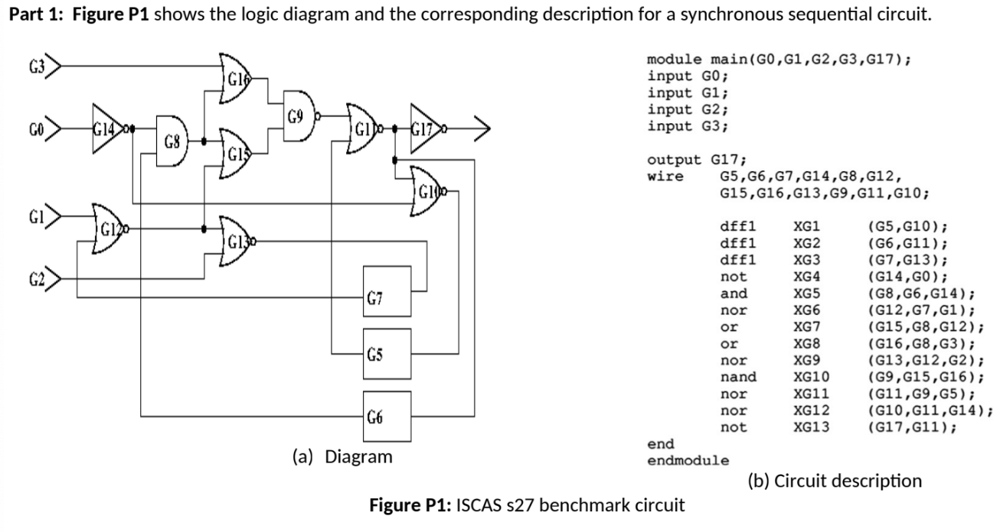

# Compiler

## Problem Statement

<p align="center">
  
</p>

The ISCAS benchmark circuit description, shown in Figure P1(b), consists of a set of lines. Each line describes how one logic gate is interconnected with other gates. For example, line 'dff1 XG1 DFF(G5, G10)' indicates the presence of a D-type flip-flop with output G5 (connected to the state line Q) and input G10 (connected to D). 

1. Write a (C, C++) computer program that reads in the circuit description as shown in Figure P2.
2. For each gate with more than one fanout, you BUF gates so each line can be uniquely identified.
3. For every gate circuit, we associate a 'level'. The gate 'level' indicates the distance of that gate from primary inputs or pseudo inputs (D flip-flop Q's). Initially, the level of primary inputs and DFF flip-flops is set to zero. Gates 'level' for other gates are set to a negative value, indicating uninitialized values. Then, the gate 'level', with assigned positive values on all of its inputs, is equal to the maximum 'level' of its inputs plus one. This step is repeated until every gate 'level' is a positive number.
4. Your program should print the following:
a. For every 'level' n, print the number of gates assigned to level n.
b. Print a listing of the final stored circuit using an intermediate file format. The file consists of lines, where each line represents a gate in the circuit. On the first line of the file, print the number of gates, number of inputs, number of outputs, and the number of FF's. 

---

## Components

### Lexer (1st Stage)

The lexer is defined using the `tokens.l` file. It describes the lexical rules and patterns for tokenizing the Verilog source code. It identifies
the keywords, identifiers, and operators in the language.


### Parser

We are using `parser.y` to define our parser, which takes the stream of tokens from the lexer and is able
to convert that stream into an intermediate representation, which can be directly executed.

### Circuit Header File

Now, let's define a circuit data structure template:

```C
#ifndef CIRCUIT_H
#define CIRCUIT_H

#include <stdlib.h>
#include <string.h>
#include <stdio.h>

typedef enum {
    GATE_INPUT = 0,
    GATE_OUTPUT = 1,
    GATE_AND = 2,
    GATE_NAND = 3,
    GATE_OR = 4,
    GATE_NOR = 5,
    GATE_XOR = 6,
    GATE_XNOR = 7,
    GATE_BUF = 8,
    GATE_NOT = 9,
    GATE_DFF = 10,
    GATE_WIRE = 11
} GateType;

// struct to hold a list of integers (for fanins/fanouts)
typedef struct {
    int *items;
    int count;
    int capacity;
} IntList;

// struct for a gate
typedef struct {
    int id;
    char *name;              
    char *output_wire;      
    GateType type;
    int is_output;
    int level;
    IntList fanins;
    IntList fanouts;
} Gate;

// circuit struct
typedef struct {
    Gate *gates;
    int gate_count;
    int gate_capacity;
    int input_count;
    int output_count;
    int dff_count;
} Circuit;

// global circuit
extern Circuit circuit;

// function prototypes
void init_circuit(void);
void add_gate(const char *name, GateType type);
int find_gate_by_name(const char *name);
void add_connection(const char *from_name, const char *to_name);
void set_gate_as_output(const char *name);
void assign_levels(void);
void insert_buffers(void);
void print_circuit(void);
void free_circuit(void);
void resolve_dff_connections(void);

// IntList helper functions
void init_intlist(IntList *list);
void add_to_intlist(IntList *list, int value);
void free_intlist(IntList *list);

#endif
```

### Circuit Data Structure

```C
#include "circuit.h"

Circuit circuit;

void init_intlist(IntList *list) {
    list->items = NULL;
    list->count = 0;
    list->capacity = 0;
}

void add_to_intlist(IntList *list, int value) {
    if (list->count >= list->capacity) {
        list->capacity = (list->capacity == 0) ? 4 : list->capacity * 2;
        list->items = (int *)realloc(list->items, list->capacity * sizeof(int));
        if (!list->items) {
            exit(1);
        }
    }
    list->items[list->count++] = value;
}

void free_intlist(IntList *list) {
    if (list->items) {
        free(list->items);
        list->items = NULL;
    }
    list->count = 0;
    list->capacity = 0;
}

void init_circuit(void) {
    circuit.gates = NULL;
    circuit.gate_count = 0;
    circuit.gate_capacity = 0;
    circuit.input_count = 0;
    circuit.output_count = 0;
    circuit.dff_count = 0;
}

void add_gate(const char *name, GateType type) {
    if (!name) {
        return;
    }
    int idx = find_gate_by_name(name);
    if (idx >= 0) {
        return; 
    }

    if (circuit.gate_count >= circuit.gate_capacity) {
        circuit.gate_capacity = (circuit.gate_capacity == 0) ? 16 : circuit.gate_capacity * 2;
        circuit.gates = (Gate *)realloc(circuit.gates, circuit.gate_capacity * sizeof(Gate));
        if (!circuit.gates) {
            exit(1);
        }
    }

    Gate *g = &circuit.gates[circuit.gate_count];
    g->id = circuit.gate_count;
    g->name = strdup(name);
    g->output_wire = NULL;

    if (!g->name) {
        exit(1);
    }
    g->type = type;
    g->is_output = 0;
    g->level = -1; 
    init_intlist(&g->fanins);
    init_intlist(&g->fanouts);

    if (type == GATE_INPUT) {
        circuit.input_count++;
        g->level = 0; 
    } else if (type == GATE_DFF) {
        circuit.dff_count++;
        g->level = 0; 
    }
    circuit.gate_count++;
}

int find_gate_by_name(const char *name) {
    for (int i = 0; i < circuit.gate_count; i++) {
        if (strcmp(circuit.gates[i].name, name) == 0) {
            return i;
        }
    }
    return -1;
}

int find_gate_by_output_wire(const char *wire_name) {
    for (int i = 0; i < circuit.gate_count; i++) {
        if (circuit.gates[i].output_wire && 
            strcmp(circuit.gates[i].output_wire, wire_name) == 0) {
            return i;
        }
    }
    return -1;
}

void add_connection(const char *from_wire, const char *to_wire) {
    int from_id = find_gate_by_output_wire(from_wire);
    
    int to_id = find_gate_by_output_wire(to_wire);

    if (from_id < 0) {
        from_id = find_gate_by_name(from_wire);
    }
    
    if (from_id < 0 || to_id < 0) {
        fprintf(stderr, "Warning: Connection failed %s -> %s\n", from_wire, to_wire);
        return;
    }
    
    add_to_intlist(&circuit.gates[from_id].fanouts, to_id);
    add_to_intlist(&circuit.gates[to_id].fanins, from_id);
}

void set_gate_as_output(const char *name) {
    int idx = find_gate_by_name(name);
    
    if (idx < 0) {
        add_gate(name, GATE_WIRE);
        idx = circuit.gate_count - 1;
    }
    
    if (!circuit.gates[idx].is_output) {
        circuit.gates[idx].is_output = 1;
        circuit.output_count++;
    }
}

void assign_levels(void) {
    int changed = 1;
    int iteration = 0;
    
    while (changed) {
        changed = 0;
        iteration++;
        
        for (int i = 0; i < circuit.gate_count; i++) {
            Gate *g = &circuit.gates[i];
            
            if (g->level == 0) continue;

            int can_assign = 1;
            int max_level = -1;
            
            for (int j = 0; j < g->fanins.count; j++) {
                int fanin_id = g->fanins.items[j];
                int fanin_level = circuit.gates[fanin_id].level;
                
                if (fanin_level < 0) {
                    can_assign = 0;
                    break;
                }
                
                if (fanin_level > max_level) {
                    max_level = fanin_level;
                }
            }
            
            if (can_assign && max_level >= 0) {
                int new_level = max_level + 1;
                if (g->level != new_level) {
                    g->level = new_level;
                    changed = 1;
                }
            }
        }
    }
}

void insert_buffers(void) {
    int original_count = circuit.gate_count;
    int buffers_added = 0;
    
    for (int i = 0; i < original_count; i++) {
        Gate *g = &circuit.gates[i];
        
        if (g->fanouts.count > 1) {
            IntList original_fanouts;
            init_intlist(&original_fanouts);
            for (int j = 0; j < g->fanouts.count; j++) {
                add_to_intlist(&original_fanouts, g->fanouts.items[j]);
            }
            
            free_intlist(&g->fanouts);
            init_intlist(&g->fanouts);
            
            for (int j = 0; j < original_fanouts.count; j++) {
                char buf_name[256];
                sprintf(buf_name, "%s_buf%d", g->name, j);
                
                add_gate(buf_name, GATE_BUF);
                int buf_id = circuit.gate_count - 1;
                
                add_to_intlist(&g->fanouts, buf_id);
                add_to_intlist(&circuit.gates[buf_id].fanins, i);
                
                int fanout_id = original_fanouts.items[j];
                Gate *fanout = &circuit.gates[fanout_id];
                
                for (int k = 0; k < fanout->fanins.count; k++) {
                    if (fanout->fanins.items[k] == i) {
                        fanout->fanins.items[k] = buf_id;
                        break;
                    }
                }
                
                add_to_intlist(&circuit.gates[buf_id].fanouts, fanout_id);
                buffers_added++;
            }
            
            free_intlist(&original_fanouts);
        }
    }
}

void print_circuit(void) {
    int max_level = 0;
    for (int i = 0; i < circuit.gate_count; i++) {
        if (circuit.gates[i].level > max_level) {
            max_level = circuit.gates[i].level;
        }
    }
    
    printf("\nGate Levels\n");
    for (int level = 0; level <= max_level; level++) {
        int count = 0;
        for (int i = 0; i < circuit.gate_count; i++) {
            if (circuit.gates[i].level == level) {
                count++;
            }
        }
        printf("Level %d: %d gates\n", level, count);
    }
    
    printf("\nCircuit Description\n");
    printf("%d %d %d %d\n", circuit.gate_count, circuit.input_count, 
            circuit.output_count, circuit.dff_count);
    
    for (int i = 0; i < circuit.gate_count; i++) {
        Gate *g = &circuit.gates[i];
        
        printf("%d %d %d %d", (int)g->type, g->is_output, g->level, g->fanins.count);
        
        for (int j = 0; j < g->fanins.count; j++) {
            printf(" %d", g->fanins.items[j]);
        }
        
        printf(" %d", g->fanouts.count);
        for (int j = 0; j < g->fanouts.count; j++) {
            printf(" %d", g->fanouts.items[j]);
        }
        
        printf(" %s\n", g->name);
    }
    
    FILE *fp = fopen("circuit_output.txt", "w");
    if (!fp) {
        return;
    }

    fprintf(fp, "%d %d %d %d\n", circuit.gate_count, circuit.input_count, 
            circuit.output_count, circuit.dff_count);
    
    for (int i = 0; i < circuit.gate_count; i++) {
        Gate *g = &circuit.gates[i];
        
        fprintf(fp, "%d %d %d %d", (int)g->type, g->is_output, g->level, g->fanins.count);
        
        for (int j = 0; j < g->fanins.count; j++) {
            fprintf(fp, " %d", g->fanins.items[j]);
        }
        
        fprintf(fp, " %d", g->fanouts.count);
        for (int j = 0; j < g->fanouts.count; j++) {
            fprintf(fp, " %d", g->fanouts.items[j]);
        }
        
        fprintf(fp, " %s\n", g->name);
    }
    
    fclose(fp);
    printf("\nCircuit description saved to circuit_output.txt\n");
}

void free_circuit(void) {
    for (int i = 0; i < circuit.gate_count; i++) {
        free(circuit.gates[i].name);
        if (circuit.gates[i].output_wire) { 
            free(circuit.gates[i].output_wire);
        }
        free_intlist(&circuit.gates[i].fanins);
        free_intlist(&circuit.gates[i].fanouts);
    }
    
    if (circuit.gates) {
        free(circuit.gates);
    }
    
    init_circuit();
}
```

---

## Test Verilog Code

With this in mind, we can test the Verilog code from the assignment. To compile using our compiler, we can run the custom Makefile, which creates an executable called `circuit_parser`. When the directory is downloaded, run:

```
make clean
make
./circuit_parser s27.v
```

---

## Results / Analysis

```
Parsing file: s27.v
 main   G0   G1   G2   G3   G17   G0  Input declaration processed
 G1  Input declaration processed
 G2  Input declaration processed
 G3  Input declaration processed
 G17  Output declaration processed
Wire declaration
 G5   G6   G7   G14   G8   G12   G15   G16   G13   G9   G11   G10   XG1   G5   G10   XG2   G6   G11   XG3   G7   G13   XG4   G14   G0   XG5   G8   G6   G14   XG6   G12   G7   G1   XG7   G15   G8   G12   XG8   G16   G8   G3   XG9   G13   G12   G2   XG10   G9   G15   G16   XG11   G11   G9   G5   XG12   G10   G11   G14   XG13   G17   G11  
Finished parsing module.
Resolving 3 DFF connections...
  Connecting DFF: G10 -> G5
  Connecting DFF: G11 -> G6
  Connecting DFF: G13 -> G7

Total gates after parsing: 18
Inputs: 4, Outputs: 1, DFFs: 3


Before inserting buffers:
XG11 fanouts: 3
  -> XG12
  -> XG13
  -> XG2

Gate Levels
Level 0: 7 gates
Level 1: 2 gates
Level 2: 4 gates
Level 3: 2 gates
Level 4: 2 gates
Level 5: 2 gates
Level 6: 1 gates
Level 7: 1 gates
Level 8: 3 gates
Level 9: 2 gates

Circuit Description
27 4 1 3
0 0 0 0 1 8 G0
0 0 0 0 1 10 G1
0 0 0 0 1 13 G2
0 0 0 0 1 12 G3
11 1 -1 0 0 G17
10 0 0 1 16 1 15 XG1
10 0 0 1 26 1 9 XG2
10 0 0 1 13 1 10 XG3
9 0 1 1 0 2 18 19 XG4
2 0 3 2 6 18 2 20 21 XG5
5 0 1 2 7 1 2 22 23 XG6
4 0 5 2 20 22 1 14 XG7
4 0 5 2 21 3 1 14 XG8
5 0 3 2 23 2 1 7 XG9
3 0 6 2 11 12 1 15 XG10
5 0 7 2 14 5 3 24 25 26 XG11
5 0 9 2 24 19 1 5 XG12
9 0 9 1 25 0 XG13
8 0 2 1 8 1 9 XG4_buf0
8 0 2 1 8 1 16 XG4_buf1
8 0 4 1 9 1 11 XG5_buf0
8 0 4 1 9 1 12 XG5_buf1
8 0 2 1 10 1 11 XG6_buf0
8 0 2 1 10 1 13 XG6_buf1
8 0 8 1 15 1 16 XG11_buf0
8 0 8 1 15 1 17 XG11_buf1
8 0 8 1 15 1 6 XG11_buf2
```

---

